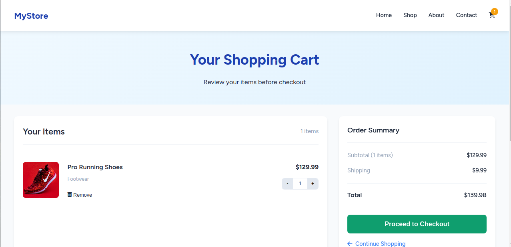
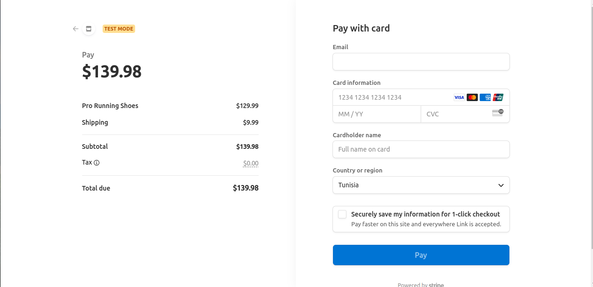

# 🛒 Laravel Shopping Cart App

A modern and responsive shopping cart system built using **Laravel**, with **AJAX-based cart management**, **cookie-based persistence**, and **Stripe integration** for seamless checkout.

## ✨ Features

- 🧾 Add, update, and remove products from cart (AJAX powered, no page reloads)
- 🍪 Cart is stored in cookies — no login required to begin
- 💵 Live subtotal and total calculations
- 🧮 Tax support (Stripe Tax)
- 🧍 Optional login during checkout (Stripe-hosted)
- 💳 Stripe Checkout integration (respects cart quantity and tax)
- 📦 Order summary updates dynamically with quantity changes

## 📸 Screenshots

1. **Shop Page**
   

2. **Order Summary**
   

3. **Stripe Checkout Integration**
   

## 🚀 Getting Started

### Requirements

- PHP 8.1+
- Laravel 10+
- Composer
- Node.js + npm (for assets)
- Stripe account

### Installation

```bash
git clone https://github.com/hazarnenni/secure-payment.git
cd secure-payment

composer install
cp .env.example .env
php artisan key:generate

npm install && npm run dev

php artisan serve

```

### Set up Stripe API keys:
- Open your .env file and add your Stripe keys:

```bash
STRIPE_KEY=pk_test_XXXXXXXXXXXX
STRIPE_SECRET=sk_test_XXXXXXXXXXXX

```
### 🧪 Testing the Checkout
- Use Stripe’s test card to simulate a checkout process:

```bash
Card Number: 4242 4242 4242 4242  
Expiration: Any future date  
CVC: Any 3 digits  
ZIP: Any 5 digits
```
